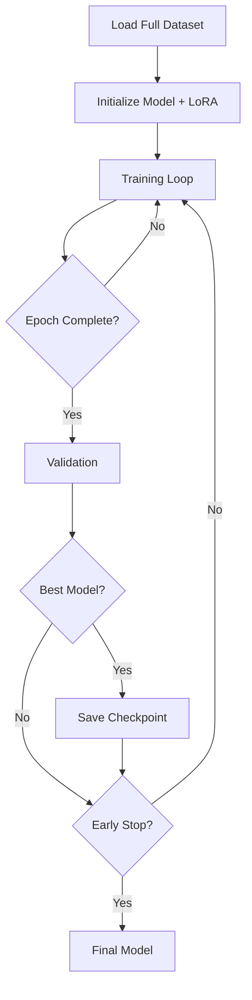
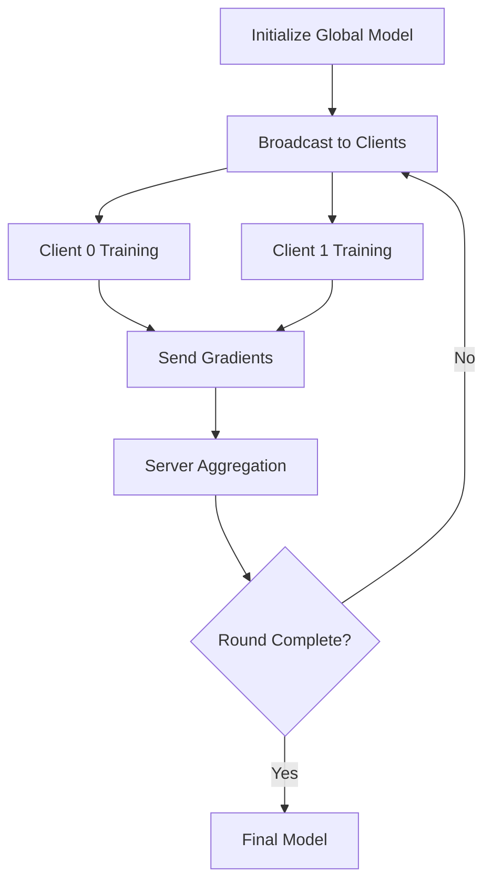

# System Architecture

This document describes the system architecture and design principles of the Federated Learning for Java Error Classification project.

## Overview

The system consists of four main components:

```
┌─────────────────────────────────────────────────────────────┐
│                     User Interface                          │
│            (CLI Scripts, Jupyter Notebooks)                 │
└─────────────┬───────────────────────────────────────────────┘
              │
┌─────────────┴───────────────────────────────────────────────┐
│                    Training Layer                           │
│  ┌──────────────┐  ┌──────────────┐  ┌─────────────────┐  │
│  │ Centralized  │  │  Federated   │  │   Evaluation    │  │
│  │   Training   │  │   Learning   │  │     Module      │  │
│  └──────────────┘  └──────────────┘  └─────────────────┘  │
└─────────────┬───────────────────────────────────────────────┘
              │
┌─────────────┴───────────────────────────────────────────────┐
│                    Model Layer                              │
│  ┌──────────┐  ┌──────────┐  ┌──────────┐  ┌──────────┐  │
│  │   Base   │  │   LoRA   │  │   4-bit  │  │ Gradient │  │
│  │   LLM    │  │ Adapter  │  │  Quant   │  │  Ckpting │  │
│  └──────────┘  └──────────┘  └──────────┘  └──────────┘  │
└─────────────┬───────────────────────────────────────────────┘
              │
┌─────────────┴───────────────────────────────────────────────┐
│                    Data Layer                               │
│  ┌──────────────┐  ┌──────────────┐  ┌─────────────────┐  │
│  │   Raw Data   │  │  Client Data │  │  Preprocessed   │  │
│  │   (JSONL)    │  │   Splitting  │  │    Tensors      │  │
│  └──────────────┘  └──────────────┘  └─────────────────┘  │
└─────────────────────────────────────────────────────────────┘
```

## Component Details

### 1. User Interface Layer

**Purpose**: Provide easy-to-use interfaces for training and evaluation

**Components**:
- **CLI Scripts**: Shell scripts in `scripts/` directory
  - `run_centralized.sh`: Run centralized training
  - `run_federated_*.sh`: Run federated learning
  - `run_evaluation.sh`: Run model evaluation
  
- **Jupyter Notebooks**: Interactive examples in `examples/`
  - `quick_start.ipynb`: End-to-end walkthrough
  
- **Python API**: Direct module imports
  ```python
  from src.training import centralized_hf
  from src.evaluation import evaluate_with_gpt
  ```

### 2. Training Layer

#### 2.1 Centralized Training

**Purpose**: Baseline training using all data in one location

**Implementation**:
```
src/training/
├── centralized_hf.py       # HuggingFace Trainer
└── centralized_unsloth.py  # Unsloth optimization
```

**Key Features**:
- Standard supervised fine-tuning
- LoRA parameter-efficient training
- 4-bit quantization for memory efficiency
- Validation-based early stopping

**Data Flow**:
```
Raw Data → Tokenization → Model Forward → Loss Computation → 
Backpropagation → Parameter Update → Validation → Save
```

#### 2.2 Federated Learning

**Purpose**: Privacy-preserving distributed training

**Algorithms Supported**:

1. **FedAvg** (Federated Averaging)
   ```python
   w_global = Σ(n_k * w_k) / Σ(n_k)
   ```
   - Simple weighted average
   - Works well for IID data

2. **FedProx** (Federated Proximal)
   ```python
   L_k = L_k(w) + (μ/2)||w - w_t||²
   ```
   - Adds proximal term
   - Better for heterogeneous data

3. **FedAdam** (Federated Adam)
   ```python
   m_t = β₁*m_{t-1} + (1-β₁)*Δw_t
   v_t = β₂*v_{t-1} + (1-β₂)*Δw_t²
   w_t = w_{t-1} - τ * m_t / (√v_t + ε)
   ```
   - Adaptive learning rates
   - Better convergence

**Communication Protocol**:
```
Round 1:
  Server → Clients: Broadcast w_global
  Clients: Local training (3 epochs)
  Clients → Server: Send gradients
  Server: Aggregate → new w_global
  
Round 2:
  ... repeat ...
```

**Multi-GPU Support**:
```python
GPU 0: Client 0, Client 2, ...
GPU 1: Client 1, Client 3, ...
# Parallel training of multiple clients
```

#### 2.3 Evaluation Module

**Purpose**: Assess model quality using multiple metrics

**Evaluation Methods**:

1. **GPT-Based Scoring**
   - Uses GPT-4o-mini as judge
   - 4 dimensions: count, type, content, duplication
   - 0-10 scale

2. **Few-Shot Baseline**
   - Evaluates base model with prompts
   - No fine-tuning required
   - Establishes lower bound

**Scoring Process**:
```
Test Sample → Model Inference → Generated Output → 
GPT Judge → Dimension Scores → Overall Score
```

### 3. Model Layer

#### 3.1 Base LLM

**Supported Models**:
- Qwen3-4B-Base (4 billion parameters)
- Qwen3-8B-Base (8 billion parameters)

**Architecture**:
```
Transformer Decoder:
  - Multi-head attention
  - Feed-forward network
  - Layer normalization
  - Residual connections
```

#### 3.2 LoRA Adapter

**Purpose**: Parameter-efficient fine-tuning

**Configuration**:
```python
r = 16              # Low rank
α = 32              # Scaling factor
dropout = 0.05      # Regularization

# Target modules
targets = [
    "q_proj", "k_proj", "v_proj", "o_proj",  # Attention
    "gate_proj", "up_proj", "down_proj"      # FFN
]
```

**Parameter Efficiency**:
```
Total params: 4B
Trainable params: ~67M (1.6%)
Memory savings: 90%+
```

#### 3.3 Quantization

**4-bit NF4 Quantization**:
```python
config = BitsAndBytesConfig(
    load_in_4bit=True,
    bnb_4bit_quant_type="nf4",
    bnb_4bit_use_double_quant=True,  # Nested
    bnb_4bit_compute_dtype=torch.bfloat16
)
```

**Benefits**:
- 75% memory reduction
- Minimal accuracy loss (<1%)
- Enables training on consumer GPUs

#### 3.4 Gradient Checkpointing

**Purpose**: Trade computation for memory

**Implementation**:
```python
model.gradient_checkpointing_enable()
# Recomputes activations during backward pass
# Saves 40-60% memory
```

### 4. Data Layer

#### 4.1 Raw Data Format

**JSONL Structure**:
```json
{
  "system_prompt": "Analyze the Java code...",
  "user_prompt": "Requirement... Code...",
  "feedback": "1) [Error Type] - explanation..."
}
```

**Data Statistics**:
- Training: ~800 samples
- Validation: ~100 samples
- Test: ~130 samples

#### 4.2 Data Preprocessing

**Pipeline**:
```
Raw JSONL → Parse JSON → Format Messages → 
Tokenize → Truncate/Pad → Create Batches
```

**Tokenization**:
```python
messages = [
    {"role": "system", "content": system_prompt},
    {"role": "user", "content": user_prompt},
    {"role": "assistant", "content": feedback}
]

text = tokenizer.apply_chat_template(messages)
tokens = tokenizer(text, max_length=1536, truncation=True)
```

#### 4.3 Client Data Splitting

**For Federated Learning**:
```python
# Split data among clients
Client 0: samples[0::2]  # 50%
Client 1: samples[1::2]  # 50%

# Ensures privacy: each client only sees its data
```

## Training Workflow

### Centralized Training



### Federated Learning



## Data Flow

### Training Data Flow

```
┌─────────────┐
│  Raw Data   │
│  (JSONL)    │
└──────┬──────┘
       │
       ▼
┌─────────────┐
│  Tokenize   │
│  + Encode   │
└──────┬──────┘
       │
       ▼
┌─────────────┐
│   Batch     │
│  Creation   │
└──────┬──────┘
       │
       ▼
┌─────────────┐
│   Model     │
│  Forward    │
└──────┬──────┘
       │
       ▼
┌─────────────┐
│    Loss     │
│ Computation │
└──────┬──────┘
       │
       ▼
┌─────────────┐
│  Backward   │
│    Pass     │
└──────┬──────┘
       │
       ▼
┌─────────────┐
│  Optimizer  │
│    Step     │
└──────┬──────┘
       │
       ▼
┌─────────────┐
│   Update    │
│   Weights   │
└─────────────┘
```

### Evaluation Data Flow

```
┌─────────────┐
│ Test Sample │
└──────┬──────┘
       │
       ▼
┌─────────────┐
│  Tokenize   │
└──────┬──────┘
       │
       ▼
┌─────────────┐
│   Model     │
│  Generate   │
└──────┬──────┘
       │
       ▼
┌─────────────┐
│   Decode    │
│   Output    │
└──────┬──────┘
       │
       ▼
┌─────────────┐
│ GPT Judge   │
│   Scoring   │
└──────┬──────┘
       │
       ▼
┌─────────────┐
│   Metrics   │
│ Aggregation │
└─────────────┘
```

## Design Principles

### 1. Modularity

Each component is independent and reusable:
```python
# Easy to swap implementations
from src.training import centralized_hf, centralized_unsloth
from src.training import federated_fedavg, federated_fedadam
```

### 2. Configurability

All hyperparameters in config objects:
```python
class Config:
    MODEL_NAME = "Qwen/Qwen3-4B-Base"
    LORA_R = 16
    LEARNING_RATE = 1e-4
    # ... easy to modify
```

### 3. Extensibility

Easy to add new features:
- New algorithms: Subclass `FederatedStrategy`
- New models: Add to model registry
- New metrics: Extend `Evaluator` class

### 4. Efficiency

Optimizations throughout:
- 4-bit quantization
- Gradient checkpointing
- Multi-GPU parallelism
- Efficient data loading

## Security Considerations

### Federated Learning Privacy

**What's Protected**:
- Raw training data never leaves client devices
- Only gradients are shared with server
- Server never sees individual samples

**Potential Vulnerabilities**:
- Gradient inversion attacks
- Model inversion attacks
- Membership inference attacks

**Mitigations**:
- Differential privacy (can be added)
- Secure aggregation (can be added)
- Gradient clipping

### Model Security

**Considerations**:
- Model weights are public after training
- Outputs may leak training data
- API key security for GPT evaluation

## Performance Optimization

### Memory Optimization

1. **4-bit Quantization**: 75% reduction
2. **Gradient Checkpointing**: 40-60% reduction
3. **Batch Size 1**: Minimal memory per sample
4. **Gradient Accumulation**: Virtual larger batches

### Speed Optimization

1. **Unsloth**: 2-3x faster than HuggingFace
2. **BFloat16**: Faster on Ampere+ GPUs
3. **Multi-GPU**: Parallel client training
4. **Efficient Data Loading**: Num workers = 4

### Scalability

**Current**:
- 2 clients, 2 GPUs
- 4B-8B parameter models
- ~1K training samples

**Scalable to**:
- 10+ clients, 10+ GPUs
- 70B parameter models
- 100K+ samples

## Future Enhancements

1. **Differential Privacy**: Add DP-SGD
2. **Secure Aggregation**: Encrypted gradients
3. **Model Compression**: Pruning, distillation
4. **Multi-task Learning**: Multiple error types
5. **Active Learning**: Smart sample selection
6. **Continual Learning**: Update without forgetting

---

**Last Updated**: December 2024
